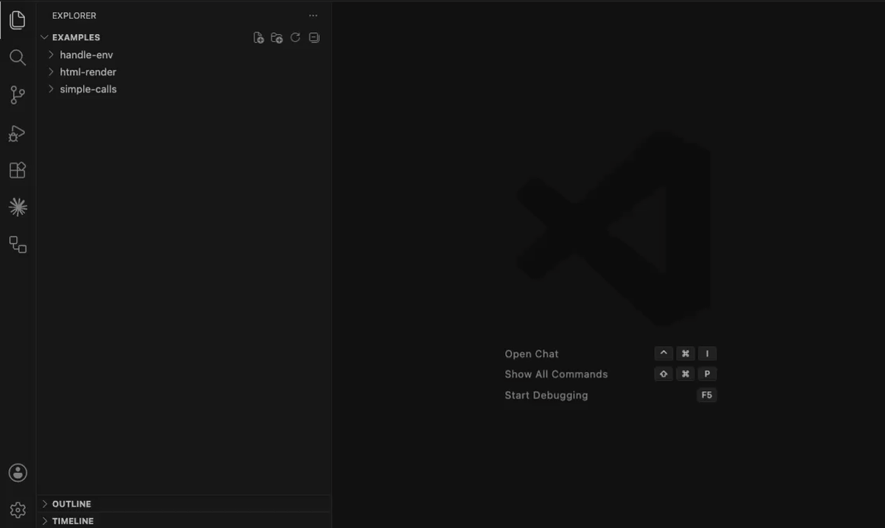

# API Companion for VS Code

API Companion brings a Postman-like request workflow directly into Visual Studio Code. It lets developers define API requests as readable `.api.json` files, edit them through a focused request UI, and send them from the editor without switching tools.

Because requests live in your workspace, they can be reviewed, shared, versioned, and kept next to the code that depends on them. API Companion is especially useful when you want lightweight endpoint testing, team-friendly request definitions, and environment-based values without maintaining a separate API client collection.

<p align="center">
  
</p>

## Features

- Create and edit `.api.json` request files with a custom VS Code editor.
- Open the API Workbench for a dedicated request-building experience.
- Send HTTP and HTTPS requests from inside VS Code.
- View response status, headers, and body after execution.
- Store request definitions as plain JSON files that work well with Git.
- Use sibling `.env` files to substitute values such as hosts, tokens, and credentials.
- Keep request execution in the extension host instead of the Webview.

## Why Use API Companion?

API testing often lives outside the project, which makes requests harder to discover, review, and keep in sync with the codebase. API Companion keeps the request workflow close to the source.

Use it to:

- Document important endpoints with executable examples.
- Share API requests through the same pull requests as application code.
- Test local, staging, or production endpoints with environment variables.
- Avoid context switching while building or debugging API integrations.

## Getting Started

1. Create a file ending in `.api.json` in your workspace.
2. Add a request definition.
3. Open the file in VS Code to use the custom request editor.
4. Send the request from the editor, or run `API Companion: Open API Workbench` from the Command Palette.

Example request file:

```json
{
  "name": "Get user profile",
  "method": "GET",
  "url": "https://api.example.com/users/{{USER_ID}}",
  "headers": {
    "Authorization": "Bearer {{API_TOKEN}}",
    "Accept": "application/json"
  },
  "body": null
}
```

## Request File Format

Request files use the `.api.json` extension and support:

| Property | Required | Description |
| --- | --- | --- |
| `name` | Yes | Human-readable request name. |
| `method` | Yes | One of `GET`, `POST`, `PUT`, `PATCH`, `DELETE`, `HEAD`, or `OPTIONS`. |
| `url` | Yes | An `http` or `https` URL. |
| `headers` | No | JSON object where each header value is a string. |
| `body` | No | Any JSON value. Use `null` when the request does not need a body. |

## Environment Variables

API Companion resolves `{{VARIABLE_NAME}}` placeholders from a `.env` file in the same folder as the `.api.json` request file.

Example `.env` file:

```sh
USER_ID=123
API_TOKEN=your-token-here
BASE_URL=https://api.example.com
```

You can use variables in URLs, headers, and request bodies:

```json
{
  "name": "Create project",
  "method": "POST",
  "url": "{{BASE_URL}}/projects",
  "headers": {
    "Authorization": "Bearer {{API_TOKEN}}",
    "Content-Type": "application/json"
  },
  "body": {
    "name": "Launch Plan"
  }
}
```

## Commands

API Companion contributes these commands to VS Code:

| Command | Description |
| --- | --- |
| `API Companion: Open API Workbench` | Opens the API Workbench panel. |
| `API Companion: Load Request File` | Loads the active `.api.json` file into the API Workbench. |

## Feedback

Found a bug or have an idea for improving API Companion? Open an issue in the project repository.
